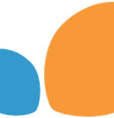

<h1 align="center">¡Hola 👋, soy Jesús Moncho!</h1>

  

<h3 align="center">no hay nada difícil, solo desconocimiento.</h3>

Soy un entusiasta de los datos 📊 y tengo dos masters relacionados con el big data y ciencia de datos en  <a href="https://assemblerinstitute.com/"> Assembler Institute of Technology</a> y otro en  <a href="https://iead.es/">iead instituto europeo de alta direción</a> 

## 💻 tecnologías utilizadas

    
  

    
    Anaconda
  

  

    
    Jupyter
  

  

    
    SQL
  

  

    
    mongoDB
  

  

    
    neo4j
  

  

    
    Python
  

  

    
    pandas
  

  

    
    Matplotlib
  

  

    
    seaborn
  

  

    
    NumPy
  

  

    
    SciPy
  

  

    
    scikit-learn
  

  

    
    PyTorch
  

  

    
    TensorFlow
  

  

    
    R
  

  

    
    Power BI
  

  

    
    Excel
  

    

## 😇 Sobre mi

Nacido en Alemania y viviendo en España desde pequeño, el desafio de completar este master ha sido una experiencia de vida enriquecedora. Me ha permitido salir de mi zona de confort y descubrir mis propias capacidades. Aquí tienes algunas de las cosas que disfruto en mi tiempo libre:

* 🚗 Como gran aficionado a los coches, me apasiona aprender sobre ellos, seguir las últimas noticias y eventos relacionados con la industria automotriz.
* 💪 Además, me gusta mantenerme en forma practicando calistenia, que es un tipo de ejercicio físico que utiliza el peso corporal como resistencia.
* 🎶 La música es una parte importante de mi vida, y disfruto explorando diferentes géneros y artistas. 
* 💹  Como aprendiz apasionado de trading e inversiones, aspiro a trabajar en proyectos emocionantes y desafiantes en este campo. Me encanta sumergirme en los mercados financieros, analizar gráficos, identificar oportunidades y tomar decisiones estratégicas. Estoy comprometido a aprender y mejorar continuamente mis habilidades, con el objetivo de alcanzar el éxito en el apasionante mundo del trading. ¡El potencial ilimitado y las emocionantes posibilidades del mercado financiero me motivan cada día a superar mis propios límites y lograr resultados.
* 🌳 Me encanta hacer escapadas para disfrutar de su belleza y tranquilidad. Ya sea explorando senderos, o simplemente relajándome al aire libre, siempre encuentro paz en la naturaleza.
* 🏋️ Me gusta enfrentarme a nuevos desafíos y superar mis límites. La sensación de lograr algo que parecía imposible es increíblemente gratificante y me impulsa a seguir creciendo y mejorando.
Estas actividades en mi tiempo libre me permiten encontrar un equilibrio entre el disfrute personal, el cuidado físico y mental, así como la exploración de nuevas pasiones y desafíos.

## 📫 Ponte en contacto conmigo

